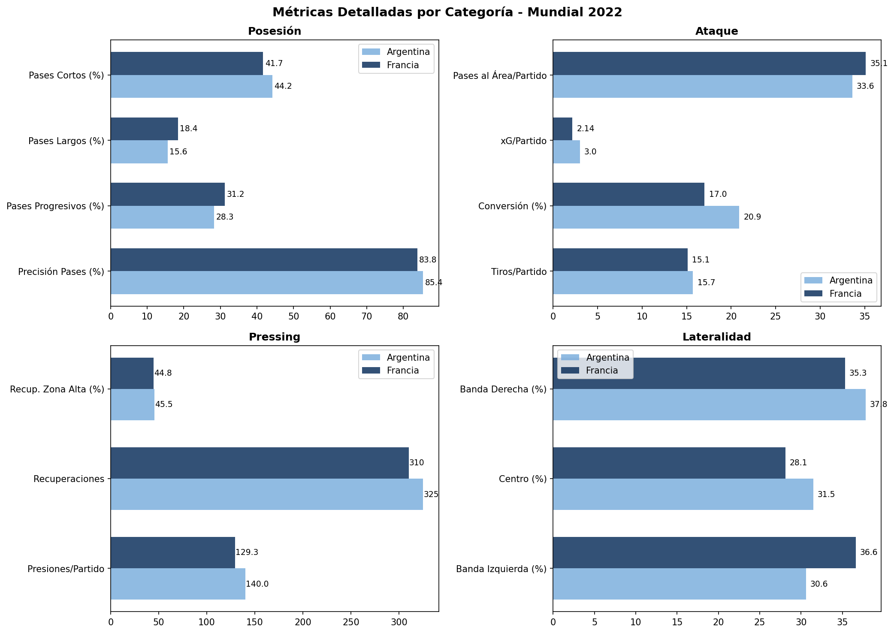
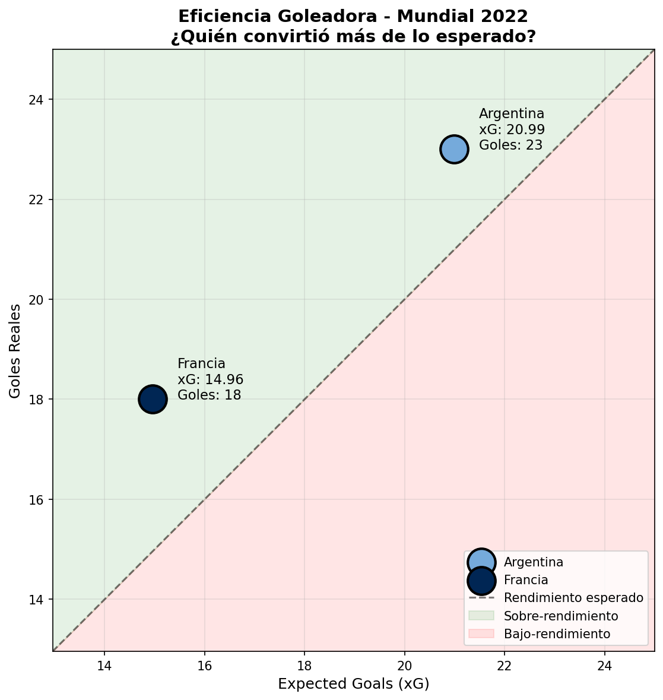
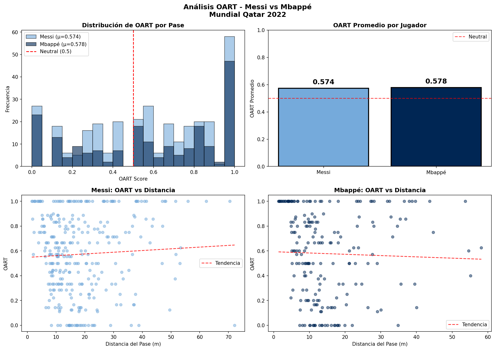
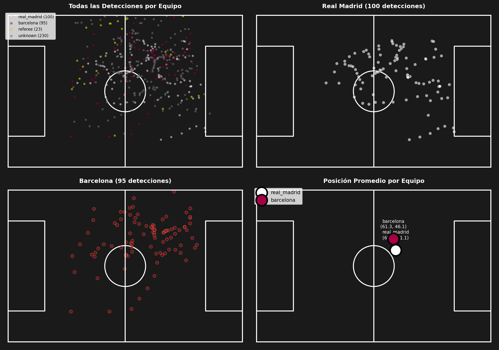

# ⚽ Football Analytics Platform

> **Plataforma de análisis táctico de fútbol con Inteligencia Artificial**

Proyecto completo de análisis de fútbol que combina Computer Vision (YOLO), Machine Learning, y datos profesionales de StatsBomb para generar insights tácticos avanzados.


---

## 📋 Tabla de Contenidos

- [Objetivo](#-objetivo)
- [Características](#-características)
- [Resultados](#-resultados)
- [Estructura del Proyecto](#-estructura-del-proyecto)
- [Instalación](#-instalación)
- [Uso](#-uso)
- [Tecnologías](#-tecnologías)

---

## 🎯 Objetivo

Desarrollar una plataforma integral de análisis de fútbol que permita:

1. **Analizar videos** con detección automática de jugadores
2. **Comparar equipos** usando métricas avanzadas de estilo de juego
3. **Evaluar jugadores** con estadísticas y métricas propias como OART
4. **Generar reportes** tácticos automáticos con IA

---

## ✨ Características

| Módulo | Descripción |
|--------|-------------|
| 📹 **Video Analysis** | Detección de jugadores con YOLOv8 + tracking |
| 📊 **Team Analysis** | Estilo de juego, pressing, posesión, xG |
| 👥 **Player Comparison** | Métricas individuales, mapas de calor |
| 🎯 **OART Metric** | Medición de riesgo en toma de decisiones |
| 📄 **Auto Reports** | Generación de reportes HTML/Markdown |

---

## 📈 Resultados

### Comparación de Equipos: Argentina vs Francia (Mundial 2022)

Análisis completo del estilo de juego de ambos finalistas:


**Hallazgos clave:**
- 🇦🇷 Argentina: Control + Eficiencia (85.4% precisión de pase)
- 🇫🇷 Francia: Transición + Talento individual (31.2% pases progresivos)





---

### Comparación de Jugadores: Messi vs Mbappé

Análisis detallado de los dos mejores jugadores del torneo:


| Métrica | Messi 🇦🇷 | Mbappé 🇫🇷 |
|---------|-----------|------------|
| Goles | 9 | 9 |
| Asistencias | 3 | 2 |
| xG | 7.6 | 5.02 |
| Sobre xG | +1.4 | +3.98 |
| Pases Clave | 16 | 9 |
| % Regates | 72.2% | 60.0% |

**Conclusión:** Messi más completo y creador, Mbappé más letal y explosivo.

---

### Métrica OART (Opportunity-Adjusted Risk Taking)

Métrica propia para medir el riesgo en la toma de decisiones de pase:



```
OART = Fracción de alternativas con mayor probabilidad de éxito
       que fueron ignoradas por el jugador

0.0 = Muy conservador (siempre elige lo más seguro)
0.5 = Neutral
1.0 = Muy arriesgado (ignora opciones seguras)
```

| Jugador | OART | Interpretación |
|---------|------|----------------|
| Messi | 0.574 | Arriesgado |
| Mbappé | 0.578 | Arriesgado |

Ambos jugadores toman riesgos similares, pero de diferente manera.

---

### Análisis de Video con YOLO

Detección y tracking de jugadores en tiempo real:




---

## 📁 Estructura del Proyecto

```
football_analytics_project/
│
├── 📄 README.md
├── 📄 requirements.txt
│
├── 📁 fase1_statsbomb/          # Análisis con datos StatsBomb
│   ├── 01_explore_data.py
│   ├── 02_pass_model.py
│   └── 03_oart_calculation.py
│
├── 📁 fase2_yolo/               # Computer Vision
│   ├── 01_detect_players.py
│   ├── 02_tracking.py
│   └── 03_extract_metrics.py
│
├── 📁 fase3_advanced/           # Análisis avanzado
│   ├── pitch_transformation.py
│   ├── team_detection.py
│   └── physical_metrics.py
│
├── 📁 fase4_platform/           # Plataforma Web
│   └── backend/
│       ├── app/
│       │   ├── main.py          # FastAPI server
│       │   └── services/
│       │       ├── video_analyzer.py
│       │       ├── team_analyzer.py
│       │       └── player_analyzer.py
│       └── static/
│           ├── index.html
│           ├── styles.css
│           └── app.js
│
├── 📁 fase5_style_analysis/     # Análisis de estilo
│   ├── 01_explore_worldcup.py
│   ├── 02_load_teams_data.py
│   ├── 03_calculate_style_metrics.py
│   ├── 04_visualize_styles.py
│   ├── 05_messi_vs_mbappe.py
│   ├── 06_oart_messi_mbappe.py
│   └── 07_generate_report.py
│
├── 📁 data/                     # Datos generados
│   ├── argentina_events.pkl
│   ├── france_events.pkl
│   └── oart_results.json
│
├── 📁 outputs/                  # Visualizaciones y reportes
│   ├── radar_comparison.png
│   ├── messi_vs_mbappe.png
│   ├── oart_comparison.png
│   └── tactical_report.html
│
└── 📁 images/                   # Imágenes para README
```

---

## 🚀 Instalación

### Requisitos previos

- Python 3.9+
- pip

### Pasos

```bash
# 1. Clonar repositorio
git clone https://github.com/tuusuario/football-analytics.git
cd football-analytics

# 2. Crear entorno virtual
python -m venv venv
source venv/bin/activate  # Linux/Mac
venv\Scripts\activate     # Windows

# 3. Instalar dependencias
pip install -r requirements.txt

# 4. Ejecutar plataforma web
cd fase4_platform/backend/app
python -m uvicorn main:app --reload --port 8000

# 5. Abrir en navegador
# http://localhost:8000
```

---

## 💻 Uso

### Plataforma Web

```bash
cd fase4_platform/backend/app
python -m uvicorn main:app --reload --port 8000
```

Abrir: `http://localhost:8000`

### Análisis de Equipos (CLI)

```python
from services.team_analyzer import compare_teams_style

result = compare_teams_style("Argentina", "France", "worldcup_2022")
print(result)
```

### Análisis de Jugadores (CLI)

```python
from services.player_analyzer import compare_two_players

result = compare_two_players("Messi", "Mbappé")
print(result)
```

### Calcular OART

```bash
cd fase5_style_analysis
python 06_oart_messi_mbappe.py
```

---

## 🛠 Tecnologías

| Categoría | Tecnología |
|-----------|------------|
| **Backend** | FastAPI, Python |
| **Computer Vision** | YOLOv8, OpenCV, Supervision |
| **Machine Learning** | XGBoost, Scikit-learn |
| **Datos** | StatsBomb, Pandas, NumPy |
| **Visualización** | Matplotlib, Seaborn |
| **Frontend** | HTML5, CSS3, JavaScript |

---

## 📊 Métricas del Modelo

| Modelo | Métrica | Valor |
|--------|---------|-------|
| Pass Prediction | AUC | 0.893 |
| Pass Prediction | Brier Score | 0.091 |
| OART Reliability | Split-half r | 0.558 |

---

## 📚 Referencias

- [StatsBomb Open Data](https://github.com/statsbomb/open-data)
- [OART Paper](https://arxiv.org/abs/...) - Quantifying Opportunity-Adjusted Risk Taking
- [YOLOv8 Documentation](https://docs.ultralytics.com/)

---

## 🤝 Contribuir

1. Fork el repositorio
2. Crea una rama (`git checkout -b feature/nueva-funcionalidad`)
3. Commit cambios (`git commit -m 'Agregar nueva funcionalidad'`)
4. Push a la rama (`git push origin feature/nueva-funcionalidad`)
5. Abre un Pull Request

---

## 📄 Licencia

MIT License - ver [LICENSE](LICENSE) para más detalles.

---

## 👤 Autor

**Tu Nombre**

- GitHub: [@tuusuario](https://github.com/tuusuario)
- LinkedIn: [Tu Perfil](https://linkedin.com/in/tuperfil)

---

<p align="center">
  <b>⚽ Hecho con pasión por el fútbol y los datos ⚽</b>
</p>